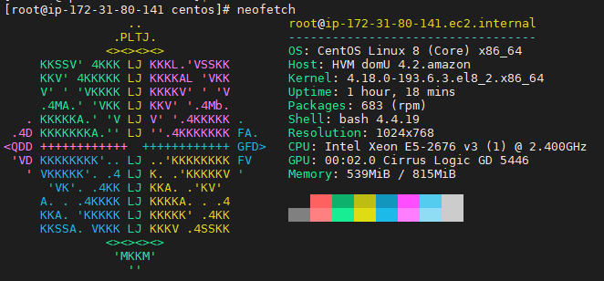
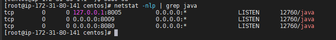
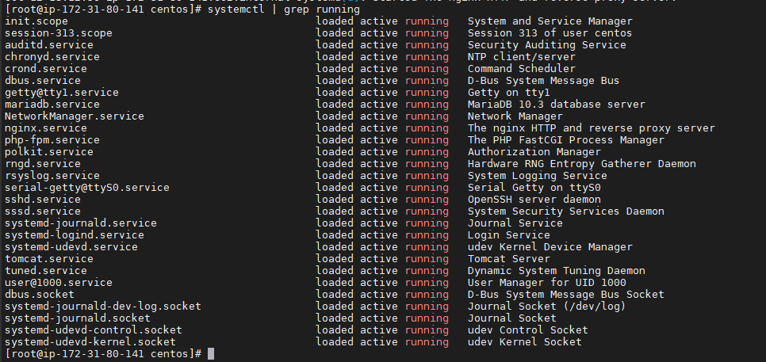

<h2>Stack</h2>
<ol>
<li>Site simples em php</li>
<li>Blog com Wordpress</li>
<li>Loja Magento</li>
<li>Proxy reverso com Nginx/TomCat</li>
</ol>
<ol>

<p>Após a criação do dominio.tk free na <a href="https://www.freenom.com/pt/index.html">Freenom</a> é necessário configurar o Route53 na aws e efetuar a criação dos subdomínios </p>
<p>Veja mais informações sobre a instância na screen shot abaixo: </p>
<p align="center">
 
</p>

---
<h2><li>Magento: </h2>

<h3>Lemp: </h3>
<p>Primeiro vamos instalar o Nginx, Mariadb, PHP e as bibliotecas necessárias do PHP, utilizando o comando abaixo</p>
</ol>

```bash
dnf install nginx mariadb-server php php-cli php-mysqlnd php-opcache php-xml php-gd php-soap php-bcmath php-intl php-mbstring php-json php-iconv php-fpm php-zip unzip git -y
```

1. Iniciando e habilitando os serviços

```
systemctl start nginx mariadb php-fpm && systemctl enable nginx mariadb php-fpm
```
2. Em seguida vamos editar o <code>php.ini</code> 


```bash
dnf install -y vim && vim /etc/php.ini
```
3. Altere as linhas de acordo com o que esta abaixo:
```
memory_limit =512M
upload_max_filesize = 200M
zlib.output_compression = On 
max_execution_time = 300 
date.timezone = America/Sao_Paulo
```

<h3>Configurando banco de dados</h3>
<p>De as permissoes de acordo com a saida abaixo:</p>
<code>mysql_secure_installation</code>

```
Set root password? [Y/n] Y
New password: 
Re-enter new password: 
Remove anonymous users? [Y/n] Y
Disallow root login remotely? [Y/n] Y
Remove test database and access to it? [Y/n] Y
Reload privilege tables now? [Y/n] Y
```
<p>Faça login no banco com o comando abaixo e forneça uma senha </p>
<code>mysql -u root -p</code>

```
> CREATE DATABASE magentodb;

> GRANT ALL ON magentodb.* TO magento@localhost IDENTIFIED BY 'G4briel95';
 ```
<p>Depois vamos liberar os privilegios e sair.</P>

```
> flush privileges;
> exit;
```

<p>Vamos configurar o php-fpm para trabalhar com o magento</p>
<code>vim /etc/php-fpm.d/magento.conf</code>

```
[magento]
user = nginx
group = nginx
listen.owner = nginx
listen.group = nginx
listen = /run/php-fpm/magento.sock
pm = ondemand
pm.max_children =  50
pm.process_idle_timeout = 10s
pm.max_requests = 500
chdir = /

```
<p>Salve e saia</p>

<code>systemctl restart php-fpm</code>

<p>Agora que temos um Lemp configurado na maquina e preparado para rodar o magento, temos que solucionar outro problema, essa é uma instância t2.micro <a href="https://aws.amazon.com/pt/free/?all-free-tier.sort-by=item.additionalFields.SortRank&all-free-tier.sort-order=asc">Free-Tier</a>, logo, ela tem apenas 1gb de memória ram e o minimo recomendado para rodar o magento é 2GB, para contornar isso vamos adicionar memória <a href="https://butecotecnologico.com.br/adicionando-swap-ao-centos-ubuntu-e-derivados/">Swap</a> ao nosso servidor, no meu caso eu adicionei 4GB (Melhor sobrar do que faltar) mas você pode usar o quanto considerar necessário, acredito que 1GB ou 2GB ja é o suficiente. </p>
<p>Primeiro vou criar o arquivo swapfile de 4GB com o comando abaixo</p>
<code>fallocate -l 4G /swapfile</code>
<p>Vamos verificar se o arquivo foi criado corretamente</p>
<code>ls -lh /swapfile</code>
<p>Vamos habilitar o swap</p>
<code>chmod 600 /swapfile</code>
<p>Agora vamos montar o swap</p>
<code>mkswap /swapfile</code>


<p> E por fim vamos habilitar o swap de forma permanente</p>

```
swapon /swapfile
vim /etc/fstap
```
<p>E adicionar a linha abaixo no final do arquivo</p>
<code>/swapfile none swap sw 0 0</code>

<p>Com o comando abaixo vamos turbinar o swap para economizar memória</p>
<code>sysctl vm.swappines=50</code>

<p>para que a configuração fique permanente vamos alterar o arquivo <code>vim /etc/sysctl.conf</code></p>

<p>E adicionar ao fim do arquivo a linha: </p>
<code>vm.swappiness=50</code>

<p>E finalmente vamos fazer download do magento:</p>
<code>cd /var/www/html &&
wget https://github.com/magento/magento2/archive/2.3.zip
</code>

<p>Pós a finalização do download vamos descompactar o mesmo</p>
<code>unzip 2.3.zip</code>

<p>Vamos renomear o arquivo</p>
<code>mv magento2-2.3 magento2</code>

<p>Agora vamos instalar o composer</p>

```
curl -sS https://getcomposer.org/installer | php
mv composer.phar /usr/local/bin/composer
```
<p>Em seguida, vamos navegar para o diretorio do magento e rodar os comandos abaixo para instalar o magento</p>

```
cd /var/www/html/magento2
composer update
composer install
```
<p>Em seguida, vamos dar as permissões necessárias para o diretório do magento, onde o dono do mesmo precisa ser o nginx</p>

```
chown -R nginx:nginx /var/www/html/magento2
chmod -R 755 /var/www/html/magento2
```
<p>Vamos configurar o virtual host do nginx para apontar para o magento</p>
<code>vim /etc/nginx/conf.d/magento.conf</code>

```
upstream fastcgi_backend {
  server   unix:/run/php-fpm/magento.sock;
}

server {
    listen 80;
    server_name loja.blog.alvestask.tk;

    set $MAGE_ROOT /var/www/html/magento2;
    set $MAGE_MODE developer;

    access_log /var/log/nginx/magento-access.log;
    error_log /var/log/nginx/magento-error.log;

    include /var/www/html/magento2/nginx.conf.sample;
}
```
<p>Salve, saia e em seguida reinicie os serviços do nginx e php-fpm para que as configurações serem implementadas, antes é importante validar o nginx com o comando <code> nginx -t</code></p>

```
systemctl restart php-fpm nginx
```

<p>Vamos manter o selinux habilitado então para isso, vamos configuralo para as devidas permissões</p>

<p>Como o semanage não vem instalado por default no CentOS8, vamos instalalo utilizando o comando abaixo</p>

```
yum install -y policycoreutils-python-utils

#Depois vamos configurar o mesmo: 
semanage permissive -a httpd_t
```
<p>vamos instalar e configurar o Firewalld para termos mais segurança</p>

```
dnf install -y firewalld
firewall-cmd --permanent --add-service=http
firewall-cmd --permanent --add-service=https
firewall-cmd --reload
```
<p>vamos criar um cronjob para os indexadores do magento (necessário apenas caso for entrar em produção) </p>

```
cd /var/www/html/magento2
crontab -u nginx -e
# crontab -u nginx -e

* * * * * /usr/bin/php /usr/share/nginx/html/magento2/bin/magento cron:run | grep -v "Ran jobs by schedule" >> /usr/share/nginx/html/magento2/var/log/magento.cron.log
* * * * * /usr/bin/php /usr/share/nginx/html/magento2/update/cron.php >> /usr/share/nginx/html/magento2/var/log/update.cron.log
* * * * * /usr/bin/php /usr/share/nginx/html/magento2/bin/magento setup:cron:run >> /usr/share/nginx/html/magento2/var/log/setup.cron.log
```

<p>E por fim podemos acessar o magento atravéz do nosso dominio que no meu caso é o  loja.blog.alvestask.tk e finalizar as configurações.</p>
<p align="center">
 
</p>

---

<h2><li>Wordpress</h2>
<p>Primeiro vamos criar uma nova base de dados para o wordpress</p>

```
> CREATE DATABASE wordpress;
> CREATE USER wpuser@localhost IDENTIFIED BY 'G4briel95';
> GRANT ALL ON wordpress.* TO wpuser@localhost;
> FLUSH PRIVILEGES;
> QUIT;
```
<p>Download e descompactação do wordpress:</p>

```
cd /var/www/html
wget https://wordpress.org/latest.tar.gz
dnf install -y tar && tar -zxvf latest.tar.gz
rm latest.tar.gz -f
```
<p>Configurando permissões:</p>

```
find /var/www/html/wordpress/ -type d -exec chmod 755 {} \;
find /var/www/html/wordpress/ -type f -exec chmod 644 {} \;
```
<p>Agora vamos criar/configurar o Vhost nginx do wordpress para apontar para o diretorio onde realizamos o download do wordpress, minhas configurações ficaram da seguinte forma:</p>

```
vim /etc/nginx/conf.d/wordpress.conf
server {
   listen 80;
   server_name blog.alvestask.tk;

   # note that these lines are originally from the "location /" block
   root /var/www/html/wordpress;
   index index.php index.html index.htm;

   location / {
      try_files $uri $uri/ =404;
   }
   error_page 404 /404.html;
   error_page 500 502 503 504 /50x.html;
   location = /50x.html {
      root /var/www/html/wordpress;
   }

   location ~ \.php$ {
      try_files $uri =404;
      fastcgi_pass unix:/var/run/php-fpm/www.sock;
      fastcgi_index index.php;
      fastcgi_param SCRIPT_FILENAME $document_root$fastcgi_script_name;
      include fastcgi_params;
   }
}
```

<p>Vamos testar o nginx e caso a saida seja 'sucess' vamos rodar um restart no nginx e no php-fpm</p>

```
nginx -t
systemctl restart nginx php-fpm
```
<p>Vamos alterar os diretorios para a instalação do wordpress e dar permissão para o nginx: </p>

```
cd /var/www/html/wordpress
cp wp-config-sample.php wp-config.php
chown nginx.nginx wp-config.php
```

<p>Gerar sais para o wordpress</p>

```
curl -s https://api.wordpress.org/secret-key/1.1/salt/
#Saida:
define('AUTH_KEY', ';]wL<]6QUL =7|MU$b;01u?;+-4|pDCRU9zHjGs2YwSWiWR@2n3t+lfua-+s^bi[');
define('SECURE_AUTH_KEY', 'G+Y[;~YIn|2V.TIOxN6Quo<V_4s2G=0qI|6^}fI|3OBg8Q9~v[]XO!Upg,dl)OHu');
define('LOGGED_IN_KEY', 'h~Jo+S6xF^v_6>#ZZU,,Q9B [%9>nO]j4uDsaq2y3B+C6nGd~7@s8NPlIR.E,~=3');
define('NONCE_KEY', 'S_5Z?eY~@H: f;|?Q~RGkaQsJFI0p<M}%#V{r~N##M:jw=lxTd6uzl sO31ay-xM');
define('AUTH_SALT', '|`fx},S-Y,i6l]k.F<SiJn4@-2qs|z4*H<ehs%1{eb-9R|4A 6nZ>3s#-4rMkeD@');
define('SECURE_AUTH_SALT', '-H6f(A^2!=JE+El(hXLSQd*gB&Gq{*wl`o*Xv,N|HMD{-.o6{8p~xTvXE|+$YK|L');
define('LOGGED_IN_SALT', 'axF3sx3X#hN<,8^2(btXk;}A[+z/O2*LV[A?Y++!0r3S_Wk`ryD;irmM/8jbei8Q');
define('NONCE_SALT', '2uk&qo?P|+3$nQjsLs:L<2I|#q}g~80W!*Xs-g|IT+o~n[[P_]7z>%uT{+lbZ>:o');

```

<p>mariadb configurações de acordo com o banco criado</p>

```
vim wp-config.php
define('DB_NAME', 'wordpress');

/** MySQL database username */
define('DB_USER', 'wpuser');

/** MySQL database password */
define('DB_PASSWORD', 'G4briel95');

/** This entry will allow you to update, install plugins or themes on WordPress without using FTP **/
define('FS_METHOD', 'direct');
```
<code>systemctl restart php-fpm nginx</code>

<p>Depois dos passos acima basta acessar via browser de acordo com o dns ao qual vc apontou que no meu caso é o blog.alvestask.tk.</p>

<p align="center">
 
</p>

---

<h2><li>Tomcat + proxy reverso: </h2>
<p>Primeiro vamos instalar o OpenJDK 8 e o Apache Tomcat/9.0.30</p>

```
sudo dnf install java-1.8.0-openjdk
java -version
#Saida
versão openjdk "1.8.0_252"
OpenJDK Runtime Environment (build 1.8.0_252-b09)
Servidor VM OpenJDK de 64 bits (versão 25.252-b09, modo misto)
```
<p>Vamos criar um usuário para o tomcat no sistema</p>

```
sudo groupadd --system tomcat
sudo useradd -d /usr/share/tomcat -r -s /bin/false -g tomcat tomcat
```

<p>Agora vamos fazer download da versão mais recente do tomcat </p>

```
wget http://mirror.nbtelecom.com.br/apache/tomcat/tomcat-9/v9.0.38/bin/apache-tomcat-9.0.38.tar.gz
```

<p>Vou descompactalo no diretorio correto e criar um link simbólico para o mesmo.</p>

```
sudo tar xvf apache-tomcat-${VER}.tar.gz -C /usr/share/
sudo ln -s /usr/share/apache-tomcat-$VER/ /usr/share/tomcat
```
<p>Agora vou dar as permissões necessárias para o mesmo, onde o diretório do tomcat passa a ser do usuário tomcat</p>

```
sudo chown -R tomcat:tomcat /usr/share/tomcat
sudo chown -R tomcat:tomcat /usr/share/apache-tomcat-$VER/ 
```

<p>Configurando o serviço: </p>

```
sudo vim /etc/systemd/system/tomcat.service
#Adicione as linhas abaixo, salve e saia

[Unit]
Description=Tomcat Server
After=syslog.target network.target

[Service]
Type=forking
User=tomcat
Group=tomcat

Environment=JAVA_HOME=/usr/lib/jvm/jre
Environment='JAVA_OPTS=-Djava.awt.headless=true'
Environment=CATALINA_HOME=/usr/share/tomcat
Environment=CATALINA_BASE=/usr/share/tomcat
Environment=CATALINA_PID=/usr/share/tomcat/temp/tomcat.pid
Environment='CATALINA_OPTS=-Xms512M -Xmx1024M'
ExecStart=/usr/share/tomcat/bin/catalina.sh start
ExecStop=/usr/share/tomcat/bin/catalina.sh stop

[Install]
WantedBy=multi-user.target

```
<p>pode ser que seja necessário atualizar o CATALINA_OPTS com os limites de memória de acordo com o seu ambiente.</p>
<p>Agora vou ativar os serviços</p>

```
sudo systemctl daemon-reload
sudo systemctl start tomcat
sudo systemctl enable tomcat
```
<p>Sempre confira o status do tomcat.service, normalmente da merd* após um reestart...
Agora vamos configurar o firewall para abrir a porta 8080 em nosso servidor
</p>

```
sudo firewall-cmd --permanent --add-port=8080/tcp
sudo firewall-cmd --reload
```
<p>Por fim, vamos editar o arquivo tomcat-users.xml para liberar os usuários que são usados para acessar a interface de gerenciamento web do Tomcat</p>

```
vim /usr/share/tomcat/conf/tomcat-users.xml
#Adicione a linha abaixo ao fim do arquivo
<user username="admin" password="G4briel95" fullName="Administrator" roles="admin-gui,manager-gui"/>
#Lembre-se de substituir o password por um seguro
```

<p>Vamos configurar um proxy reverso agora</p>
<p>Verifique se o tomcat esta vinculado há portas ipv6 com o comando abaixo</p>

```
netstat -nlp | grep java
tcp        0      0 127.0.0.1:8005          0.0.0.0:*               LISTEN      780/java
tcp        0      0 0.0.0.0:8009            0.0.0.0:*               LISTEN      780/java
tcp        0      0 0.0.0.0:8080            0.0.0.0:*               LISTEN      780/java

```

<p>No meu caso eu ja corrigi esse problema, mas caso se depare com isso é necessário criar um arquivo chamado setenv.sh dentro do diretorio /bin do Tomcat </p>

```
vim /usr/share/tomcat/bin/setenv.sh

#Adicione a linha abaixo:
JAVA_OPTS="$JAVA_OPTS -Djava.net.preferIPv4Stack=true -Djava.net.preferIPv4Addresses=true "
```

<p>Salve e saia: </p>

```
systemctl daemon-reload && systemctl restart tomcat
```

<p>Depois rode o comando abaixo novamente e perceba que não vai mais estar com tcp6 mas sim tcp, </p>

```
netstat -nlp | grep java
tcp        0      0 127.0.0.1:8005          0.0.0.0:*               LISTEN      780/java
tcp        0      0 0.0.0.0:8009            0.0.0.0:*               LISTEN      780/java
tcp        0      0 0.0.0.0:8080            0.0.0.0:*               LISTEN      780/java

```
<p align="center">
 
</p>

<p>Vamos conferir  os serviços com o comando abaixo, verifique se os serviços necessários estão em execução:</p>
<code>systemctl | grep running</code>
<p>Saída</p>
<p align="center">
 
</p>

---

<h3>Site simples</h3>
<p>Primeiro vamos criar um diretório no <code>/var/www/html/</code></p>
<code>mkdir /var/www/html/site</code>
<p>Agora vamos criar um index.php com apenas o comando <code>phpinfo()</code> para apresentar informações sobre nossa pagina, dessa forma vamos saber que o Vhost do Nginx vai estar apontado corretamente para o site:</p>

<p>Criando index.php</p>
<code>vim /var/www/html/site/index.php</code>
<p>Adicione as linhas abaixo no arquivo, salve e saia.</p>

```

<?php
phpinfo();
?>
```

<p>Agora vamos criar o Vhost do nginx e apontar para nosso site</p>
<code>vim /etc/nginx/conf.d/site.conf</code>
<p>Para facilitar, é possível utilizar o mesmo Vhost criado para o wordpress, apenas alterando a variável server_name, conforme abaixo:</p>

```
server {
   listen 80;
   server_name alvestask.tk;

   # note that these lines are originally from the "location /" block
   root /var/www/html/wordpress;
   index index.php index.html index.htm;

   location / {
      try_files $uri $uri/ =404;
   }
   error_page 404 /404.html;
   error_page 500 502 503 504 /50x.html;
   location = /50x.html {
      root /var/www/html/wordpress;
   }

   location ~ \.php$ {
      try_files $uri =404;
      fastcgi_pass unix:/var/run/php-fpm/www.sock;
      fastcgi_index index.php;
      fastcgi_param SCRIPT_FILENAME $document_root$fastcgi_script_name;
      include fastcgi_params;
   }
}

```
<p>Teste o site atravéz do browser:</p>
<p align="center">
 
</p>

---

<p>Por fim, vamos adicionar um certificado de segurança em todos os dns</p>
<p>1. Instalação do <a href="https://www.tecmint.com/secure-nginx-with-lets-encrypt-on-centos-8/">Certbot:</a></p>
<p>Download: </p>
<code>curl -O https://dl.eff.org/certbot-auto</code>
<p>Em seguida, vamos mover o certificado para o diretório <code>/usr/local/bin</code></p>

<code>sudo mv certbot-auto /usr/local/bin/certbot-auto</code>
<p>Em seguida vamos atribuir a permissão necessária para o arquivo do certbot</p>
<code> chmod 0755 /usr/local/bin/certbot-auto</code>

<p>Agora use o comando abaixo para o certbot buscar os Vhost's do nginx e atribuir os certificados ssl de forma automatica</p>
<code>sudo /usr/local/bin/certbot-auto --nginx</code>
<p>Quando se deparar com a tela abaixo, apenas pressione ENTER para que o certbot atribua certificados em todos os dns automaticamente:</p>
<p align="center">
 
</p>

<p>Abaixo, temos uma topologia relacionada ao que foi feito: </p>
<p align="center">
 
</p>


<p>Com isso, finalizo o desafio proposto.</p>
